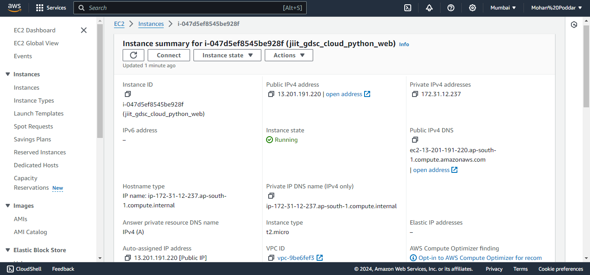
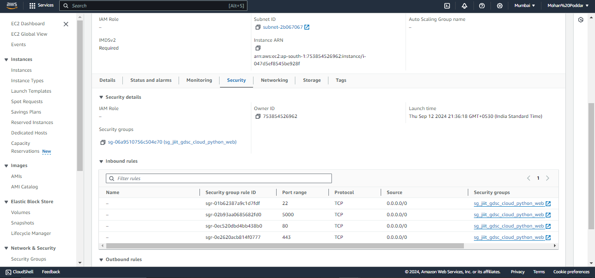
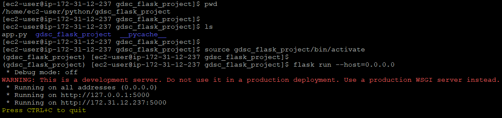
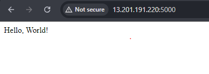
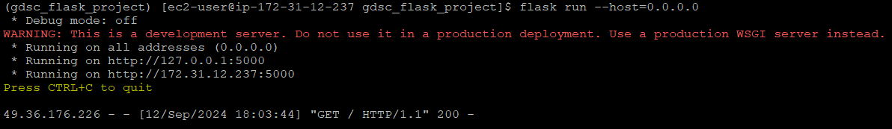

# GDSC Core Team Selection Tasks

## ML Task

### Task Description
Develop an algorithm to accurately recognize and extract car number plate information from images. The system will process car images, detect the number plate, and read the characters using image processing techniques like Optical Character Recognition (OCR) or Convolutional Neural Networks (CNNs). For example, if a car has the number AP29 AN 0074, the final output should be in text and numeric form only. The project will be evaluated on the algorithm's effectiveness in handling real-world challenges, including accuracy on a provided test set and overall efficiency. You can obtain the dataset from various sources online or use the image dataset available at https://www.kaggle.com/datasets/dataclusterlabs/indian-number-plates-dataset

The project uses a pre-trained model for detecting license plates and then another pre-trained model for ocr.

### Steps
0. Go to `ML TASK-2` directory
1. Create a pyhton virtual environment of your choice
1. Open terminal and run `pip install requirements.txt`
2. Just update the `input_dir` variable in `main.py` with the path of the directory which contains your license plate images.
3. Run the `main.py` file.
4. See the output of the license plates in the console. When the code runs, it will show you the image as well, for which it has detected text. Close the recently opened image after you have seen its output so that the code proceeds for next image.

**NOTE:** The output may or may not contain many unnecesary text which may or may not be the part of license plate. Kindly ignore it.

## Backend Task

### Task Description

1. Develop a set of backend APIs covering CRUD operations for file storage, authentication,
real-time communication using Sockets
Tasks:
CRUD APIs for File Storage:
Objective: Create APIs to upload, retrieve, update, and delete files on the server.
Requirements:
POST /files: Upload a file to the server.
GET /files/:id: Retrieve a file by its unique ID.
PUT /files/:id: Update an existing file by replacing it with a new one.
DELETE /files/:id: Delete a file from the server.
Store files in a directory on the server and keep metadata (e.g., file name, upload date) in a
database.
Optional Enhancements:
Implement file versioning or categorization.

2. Authentication APIs using Sessions or JWT:
Objective: Implement user authentication using Sessions or JSON Web Tokens (JWT).
Requirements:
POST /auth/register: Register a new user with username and password.
POST /auth/login: Authenticate a user and return a session or JWT token.
GET /auth/logout: Log out the user, invalidating the session or token.
Protect the file storage CRUD APIs to allow access only to authenticated users.
Implement registration and login APIs with basic session management or token generation.
Optional Enhancements:
Implement password reset functionality.
Implement role-based access control.

### Steps
0. Go to `BACKEND TASK` directory
1. Create a pyhton virtual environment of your choice and go to it.
2. Open terminal and run `pip install requirements.txt`
3. Now run `flask shell`
4. Run the following code to make the database:
```Python
>>> from app import db
>>> db.create_all()
>>> exit()
```
5. Now run `python app.py`
6. Use Postman or any relevant API testing client for testing all the required api endpoints.

**NOTE:** Your JWT token will expire after 60 minutes of creation for security.

## Devops Task

1. Deploy a Simple Backend Server to AWS EC2
Objective:
Deploy a simple Flas backend server to an AWS EC2 instance. The server should be accessible over the internet, and the deployment process should follow best practices for security and scalability.

**NOTE:** The node.js part has been changed to flask after taking relevant permission from gdsc members.

### Steps:

The flask server is deployed on an AWS EC2 instance (RHEL9) and the relevant code running on the server is uploaded inside `DEVOPS TASK` directory.

Use the following link to access the flask server:

http://13.201.191.220:5000







Accesing the url:
http://13.201.191.220:5000



